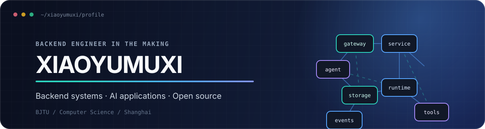
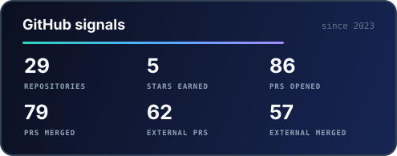
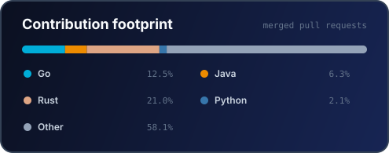

<div align="center">



<p>
  <a href="https://github.com/xiaoyumuxi"></a>
  <a href="https://blog.csdn.net/fancyfor"></a>
  <a href="https://www.xiaohongshu.com/user/profile/665d4f5a00000000070074cf"></a>
  <a href="mailto:23722032@bjtu.edu.cn"></a>
</p>

**北京交通大学 · 计算机科学与技术**<br />
把协议、并发与智能体，构建成稳定、清晰、可维护的软件。

</div>

## `01 / ABOUT`

```text
role      计算机科学与技术专业学生
focus     Java 后端 · 系统工程 · AI 应用开发
learning  Rust · 操作系统 · Agent Runtime
goal      在真实项目与开源协作中持续打磨工程能力
```

- 🔭 正在探索高性能网络通信、RPC 框架与 AI Agent 基础设施
- 🧩 喜欢从协议和底层机制出发，把复杂问题拆成可验证的模块
- 🤝 期待参与后端基础设施、开发者工具和 AI 工程相关的开源项目

## `02 / TOOLBOX`

<p align="center">
  
</p>

## `03 / GITHUB SIGNALS`

<div align="center">




<sub>Generated from the GitHub API. Public PR activity spans all repositories; known mirrors/templates are excluded from language totals.</sub>

</div>

---

<div align="center">
  <sub>Keep building. Keep learning. Make the system explain itself.</sub>
</div>
